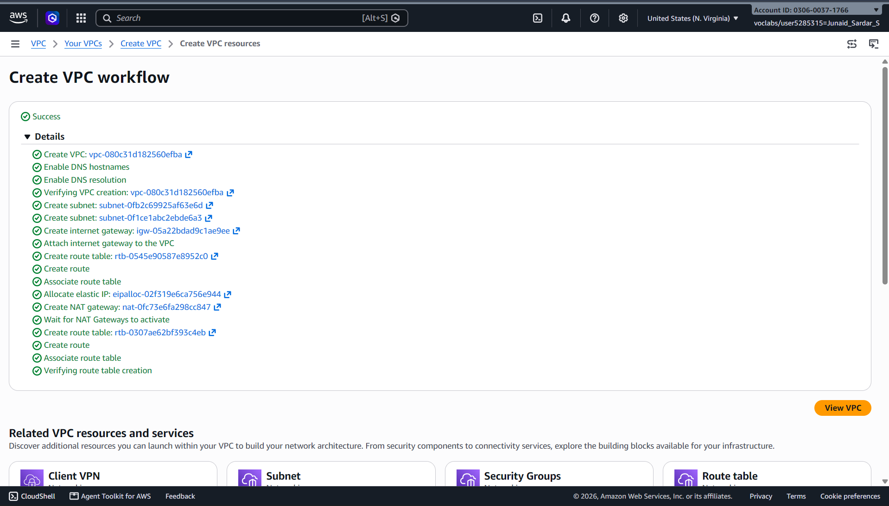
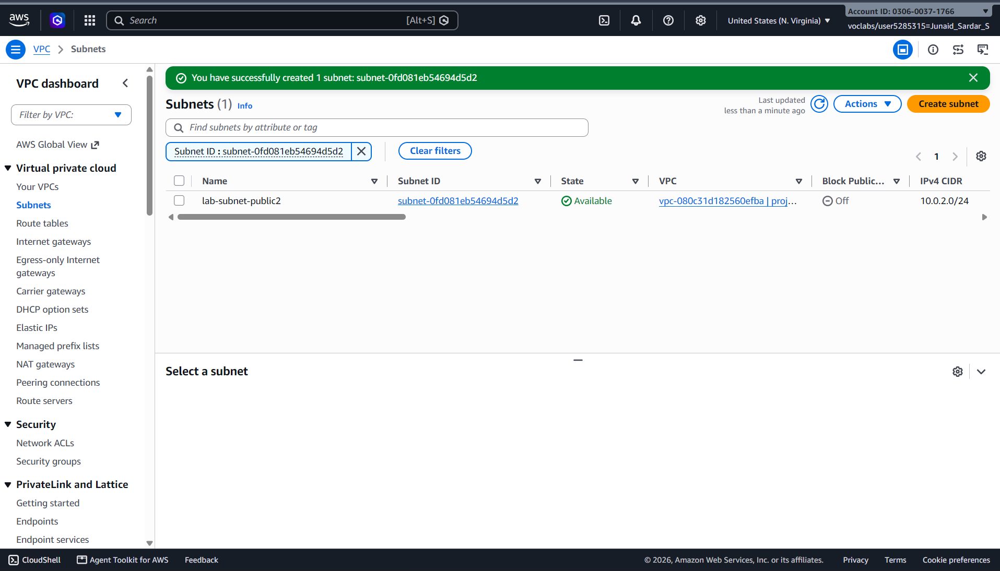
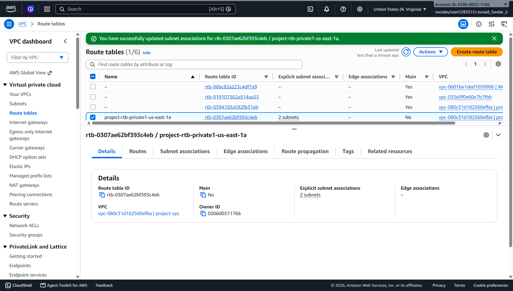
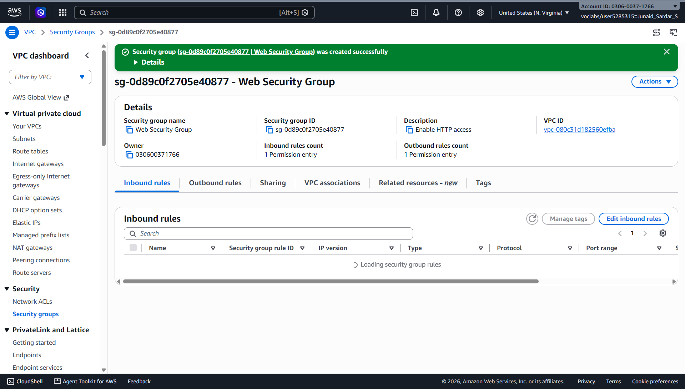
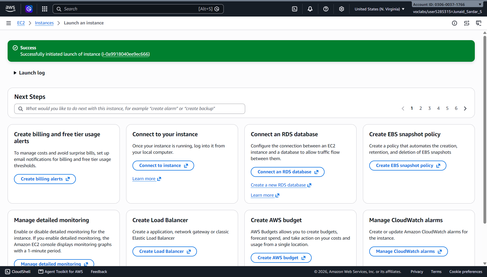

# Build Your VPC and Launch a Web Server (AWS) 

## Author

* **Name**: Junaid Sardar S
* **Register Number**: 212224100028
* **Date of Submission**: 17/08/2026

---

## Objective

The objective of this experiment is to understand how to design and configure a basic network infrastructure in AWS using a Virtual Private Cloud (VPC). This lab focuses on creating a VPC with a public subnet, configuring an Internet Gateway and route table, launching an EC2 instance, and hosting a simple web server that can be accessed over the internet.

---

## Prerequisites

* Basic understanding of cloud computing concepts
* AWS account or AWS Academy Lab access
* Web browser with internet connectivity

---

## Tools Used

* AWS Management Console
* Amazon VPC
* Amazon EC2
* Internet Gateway
* Route Table
* Security Groups

---

## Tasks Performed

### Task 1: Create a VPC

Create a new Virtual Private Cloud (VPC) with a private IP address range. The VPC acts as a logically isolated network in AWS where all other resources will be deployed.

Students should create a VPC with an appropriate CIDR block (for example, 10.0.0.0/16) and assign a meaningful name.

### Task 2: Create a Public Subnet

Create a subnet inside the VPC to host public resources. Enable auto-assign public IPv4 so that instances launched in this subnet receive a public IP address.

The subnet should use a smaller CIDR range (for example, 10.0.1.0/24).

### Task 3: Create and Attach Internet Gateway

Create an Internet Gateway (IGW) and attach it to the VPC. This allows communication between resources in the VPC and the internet.

### Task 4: Configure Route Table

Create a route table and add a default route (0.0.0.0/0) pointing to the Internet Gateway. Associate this route table with the public subnet.

This step ensures that traffic from the subnet can reach the internet.

### Task 5: Create Security Group

Create a security group to act as a virtual firewall for the EC2 instance. Configure inbound rules to allow:

SSH on port 22

HTTP on port 80

### Task 6: Launch EC2 Instance

Launch an EC2 instance inside the public subnet using Amazon Linux 2 AMI and a suitable instance type (t2.micro).

Attach the previously created security group and key pair.

### Task 7: Configure Web Server

Install and start a web server (Apache HTTPD) on the EC2 instance using user data or manual commands.

Create a simple HTML page and verify that it can be accessed from a web browser using the public IP address of the instance.---

## Workflow (Student Explanation)

1. Created a VPC with CIDR 10.0.0.0/16 and created a public subnet with CIDR 10.0.1.0/24.
2. Enabled Auto-assign Public IPv4 for the public subnet.
3. Created an Internet Gateway, attached it to the VPC, and created a route table with 0.0.0.0/0 pointing to the Internet Gateway.
4. Associated the public subnet with the route table and created a Security Group allowing SSH (port 22) and HTTP (port 80).
5. Launched an Amazon Linux EC2 instance in the public subnet with a public IPv4 address and the created security group.
6. Installed and started the Apache HTTP Server (httpd) on the EC2 instance and created a simple HTML webpage.
7. Accessed the webpage using the public IP address of the EC2 instance and verified that the web server was successfully running.

---

## Output Screenshots (Attach 3)

### Screenshot 1: VPC and Subnet Details

---

### Screenshot 2: EC2 Instance Running

---

### Screenshot 3: Web Server Output in Browser

---

## Result 

This experiment successfully demonstrated the creation of a custom VPC and deployment of a public-facing web server in AWS. By configuring networking components such as subnets, route tables, and security groups, and by launching an EC2 instance with a web server, the basic architecture of a cloud-hosted application was understood.
