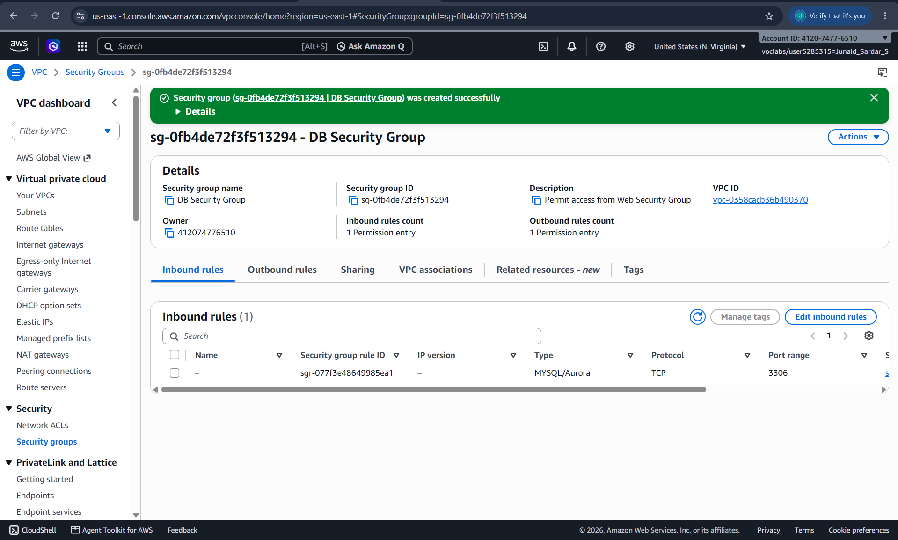
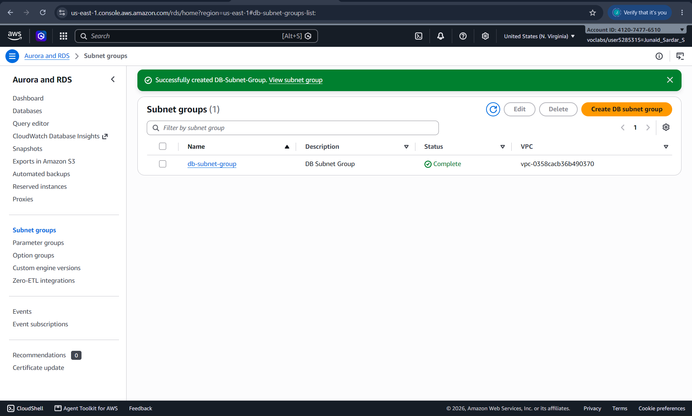
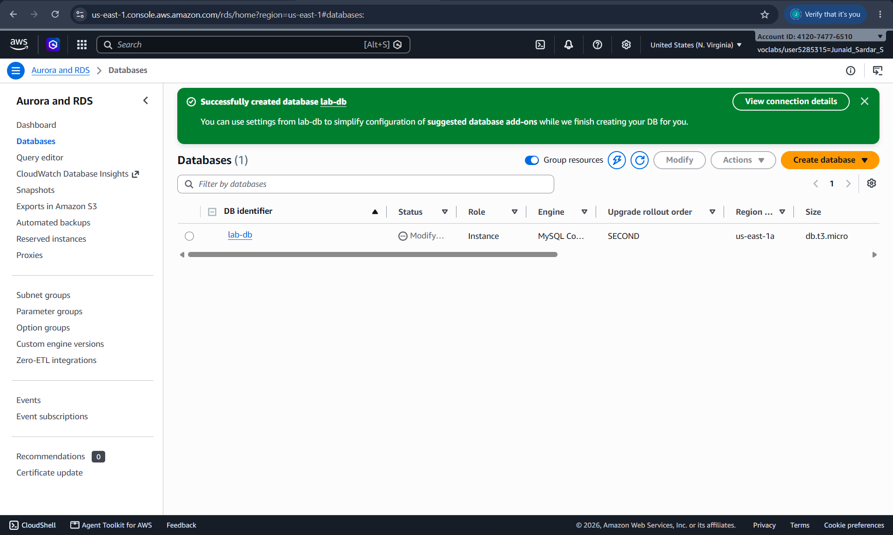
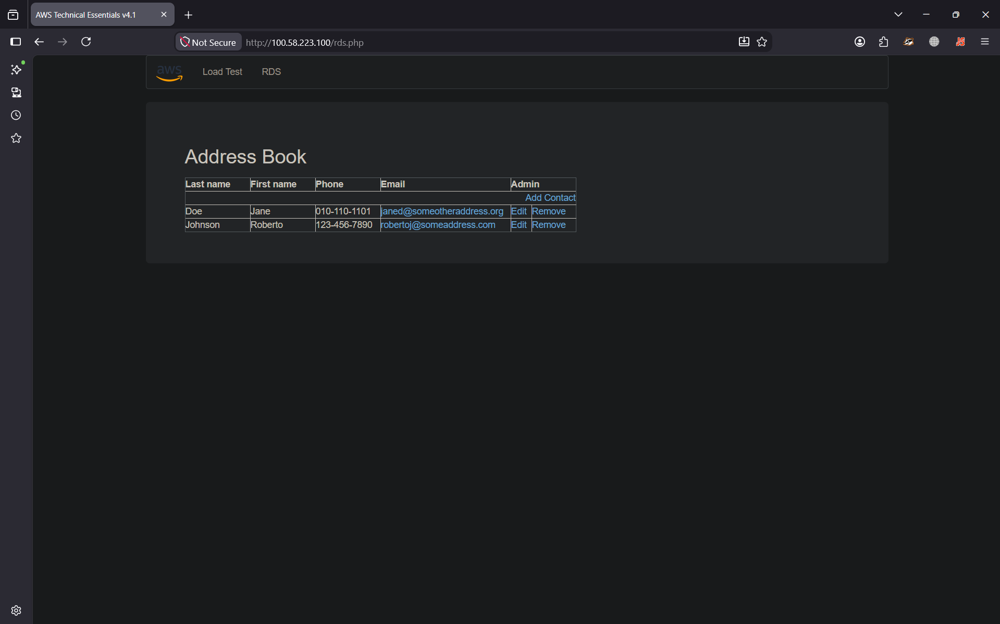

# Lab 5 – Build a Database Server (AWS)

## Author

* **Name**: Junaid Sardar S
* **Register Number**: 212224100028
* **Date of Submission**: 11/09/2026

---

## Objective

The objective of this experiment is to understand how to deploy and configure a database server in AWS. This lab focuses on launching an EC2 instance, installing a database management system (DBMS), configuring basic database settings, creating a sample database, and validating connectivity to the database server.

---

## Prerequisites

* Basic understanding of cloud computing concepts
* AWS account or AWS Academy Lab access
* An existing VPC and EC2 knowledge (from previous labs)
* Basic knowledge of Linux commands and SQL

---

## Tools Used

* AWS Management Console
* Amazon EC2
* Security Groups
* SSH Client (Terminal / PuTTY)
* MySQL / MariaDB / PostgreSQL (any one)

---

## Tasks Performed

### Task 1: Launch EC2 Instance for Database Server

Launch a new EC2 instance using Amazon Linux 2 AMI. Select an appropriate instance type and configure key pair and security group.

---

### Task 2: Configure Security Group for Database Access

Modify the security group to allow:

* SSH (Port 22) for remote access
* Database port (e.g., MySQL – 3306 or PostgreSQL – 5432)

---

### Task 3: Connect to EC2 Instance

Connect to the EC2 instance using SSH from your local machine.

---

### Task 4: Install Database Server

Install a database server software such as MySQL, MariaDB, or PostgreSQL on the EC2 instance using package manager commands.

---

### Task 5: Start and Configure Database Service

Start the database service and configure basic settings such as root password and user privileges.

---

### Task 6: Create a Sample Database

Create a sample database and a table inside it. Insert a few records into the table.

---

### Task 7: Test Database Connectivity

Test the database server by connecting to it locally or remotely and performing basic SQL queries.

---

## Workflow (Student Explanation)

1. Launch EC2 Instance – Created an EC2 instance using Amazon Linux 2 AMI, selected a suitable instance type, configured a key pair, and attached a security group.
2. Configure Security Group – Added inbound rules for SSH (Port 22) and the required database port, such as MySQL (Port 3306).
3. Connect to EC2 – Connected to the EC2 instance remotely using SSH and the configured key pair.
4. Install Database Server – Installed the required database software, such as MariaDB/MySQL, using the Linux package manager.
5. Start and Configure Database – Started the database service, enabled it to run automatically, and performed the basic database configuration and user privilege setup.
6. Create Sample Database – Created a sample database and table, then inserted a few records using SQL commands.
7. Test Connectivity – Connected to the database and executed basic SQL queries such as SELECT, INSERT, and UPDATE to verify that the database server was working correctly.

---

## Output Screenshots (Attach 3)

### Screenshot 1: EC2 Instance for Database Server

---

### Screenshot 2: Database Service Running

---

### Screenshot 3: Sample Database and Table

---

## Result

This experiment demonstrated how to build a database server in AWS using an EC2 instance. By installing and configuring a DBMS, creating a sample database, and testing connectivity, the fundamentals of hosting and managing a cloud-based database server were underst
