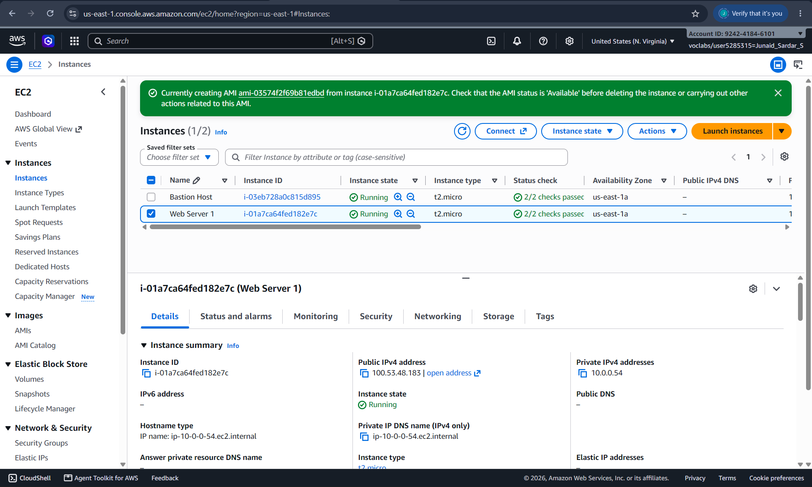
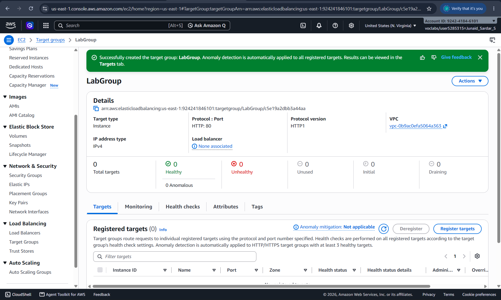
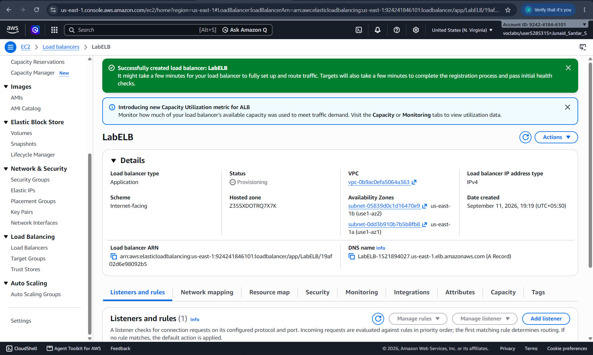
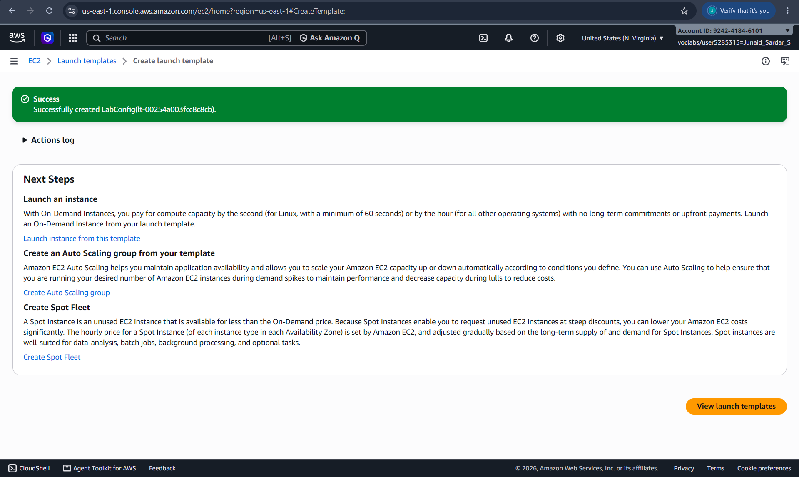
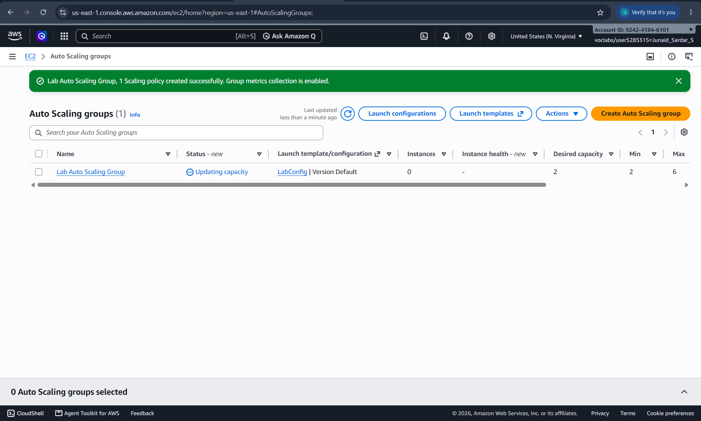
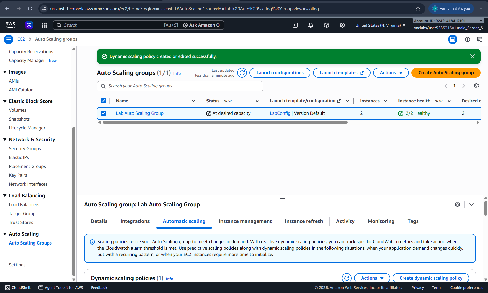

# Lab 6 – Scale and Load Balance Your Architecture

## Title

Scale and Load Balance Your Architecture
Author :Junaid Sardar S  Reg no : 212224100028  Date : 11/09/2026

---

## Objective

The objective of this lab is to understand how to design a scalable and highly available architecture on AWS using Auto Scaling and Elastic Load Balancing. This experiment focuses on distributing incoming traffic across multiple EC2 instances, automatically scaling resources based on demand, and validating fault tolerance.

---

## Prerequisites

* Basic knowledge of Amazon EC2 and VPC
* Completion of previous labs (IAM, EC2, EBS, Database Server)
* AWS Academy Lab access
* Stable internet connection

---

## Tools Used

* AWS Management Console
* Amazon EC2
* Elastic Load Balancer (ELB / ALB)
* Auto Scaling Groups (ASG)
* Amazon CloudWatch

---

## Tasks Performed

### Task 1: Review Existing Architecture

Students review the existing EC2-based application architecture created in previous experiments.

### Task 2: Create a Launch Template

Students create a launch template that defines the EC2 instance configuration including AMI, instance type, security group, and user data.

### Task 3: Create an Auto Scaling Group

Students create an Auto Scaling Group using the launch template and configure minimum, maximum, and desired instance capacity.

### Task 4: Configure an Application Load Balancer

Students create an Application Load Balancer and configure target groups for routing traffic to EC2 instances.

### Task 5: Register Auto Scaling Group with Load Balancer

Students attach the Auto Scaling Group to the target group of the load balancer.

### Task 6: Configure Scaling Policies

Students configure scaling policies based on CPU utilization using Amazon CloudWatch alarms.

### Task 7: Test Load Balancing and Scaling

Students test the setup by generating traffic and observing automatic scaling and load distribution.

---

## Workflow (To be filled by Student)

1. Reviewed the Existing Architecture – Reviewed the EC2-based application architecture created in the previous experiment and identified the resources required for scaling and load balancing.
2. Created a Launch Template – Created a launch template containing the required AMI, instance type, security group, key pair, and user data configuration for launching EC2 instances.
3. Created an Auto Scaling Group – Created an Auto Scaling Group using the launch template and configured the minimum, desired, and maximum number of EC2 instances.
4. Configured Application Load Balancer – Created an Application Load Balancer and a target group to distribute incoming application traffic among the EC2 instances.
5. Connected Auto Scaling with Load Balancer – Attached the Auto Scaling Group to the target group so that newly launched instances were automatically registered with the load balancer.
6. Configured Scaling Policies – Created CloudWatch-based scaling policies using CPU utilization to automatically increase or decrease the number of EC2 instances according to workload.
7. Tested Load Balancing and Scaling – Generated application traffic and monitored the instances through the load balancer and CloudWatch to verify that traffic was distributed properly and that EC2 instances scaled automatically.
---

## Output Screenshots 

---

## Result

This experiment demonstrated how to build a scalable and fault-tolerant cloud architecture using Auto Scaling Groups and Elastic Load Balancing. The system automatically adjusted resources based on workload and ensured continuous service availability by distributing traffic across multiple instances.
